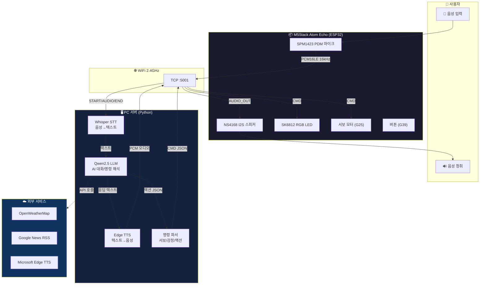
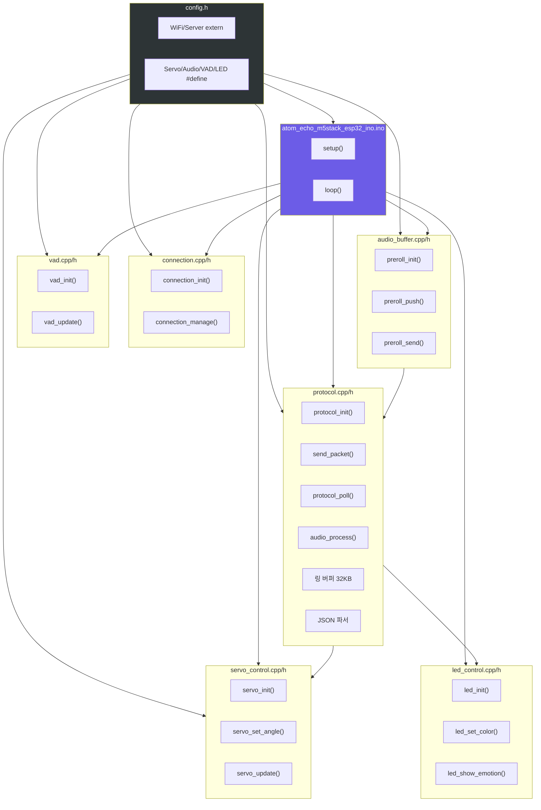
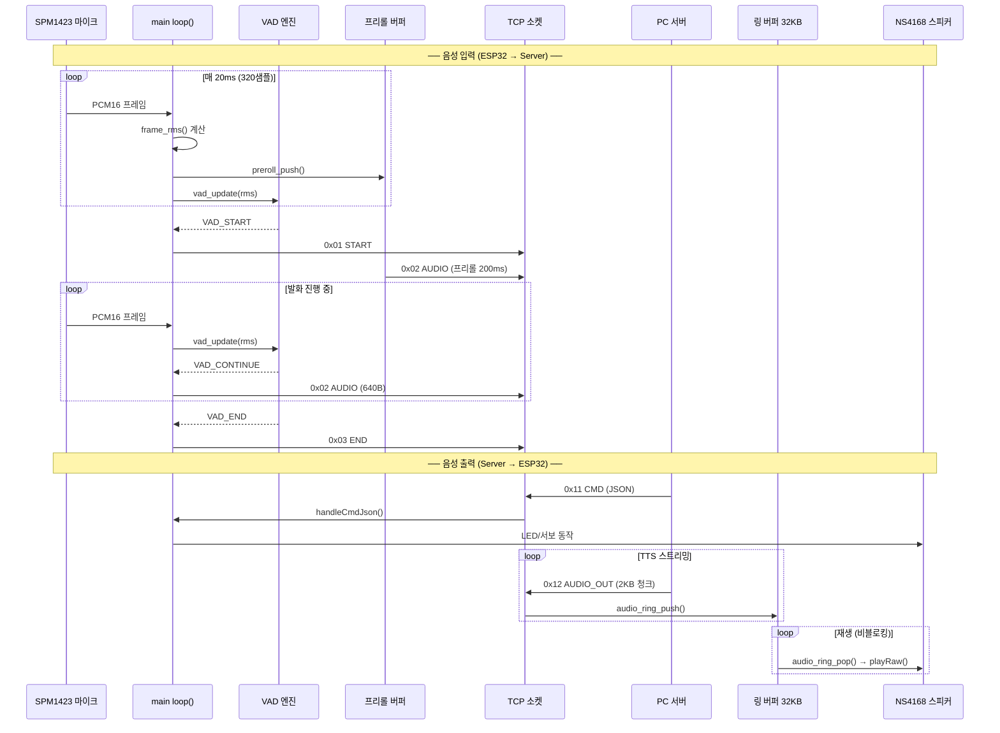
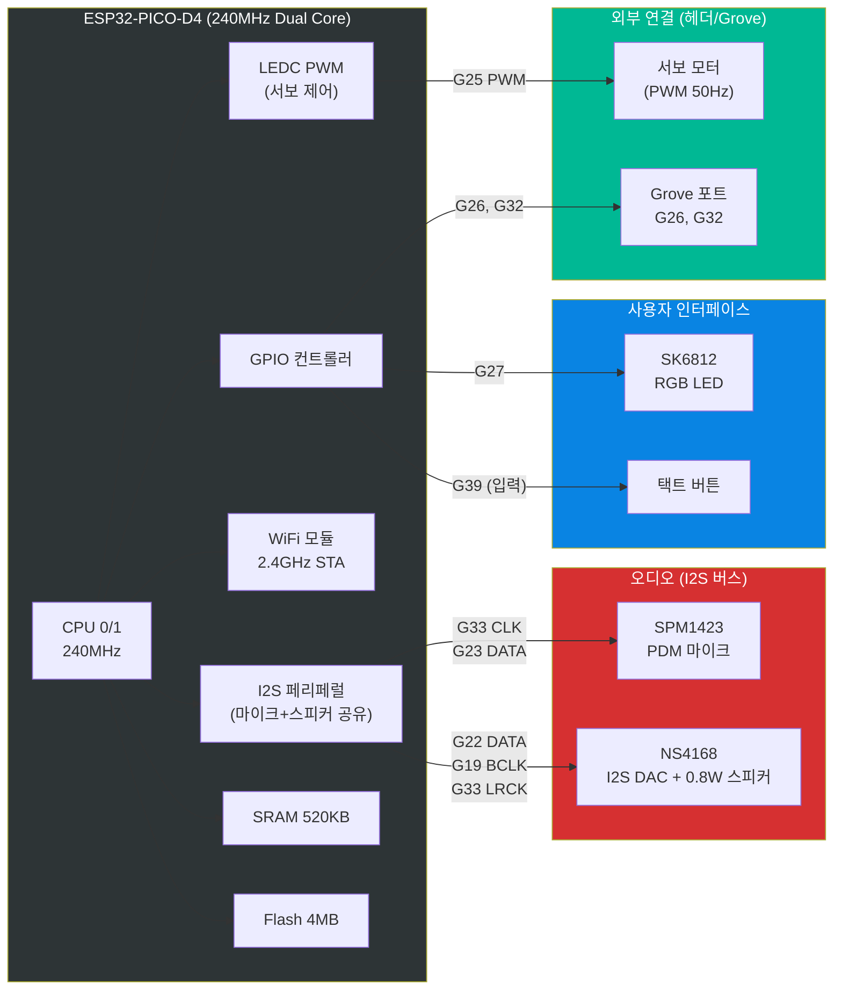
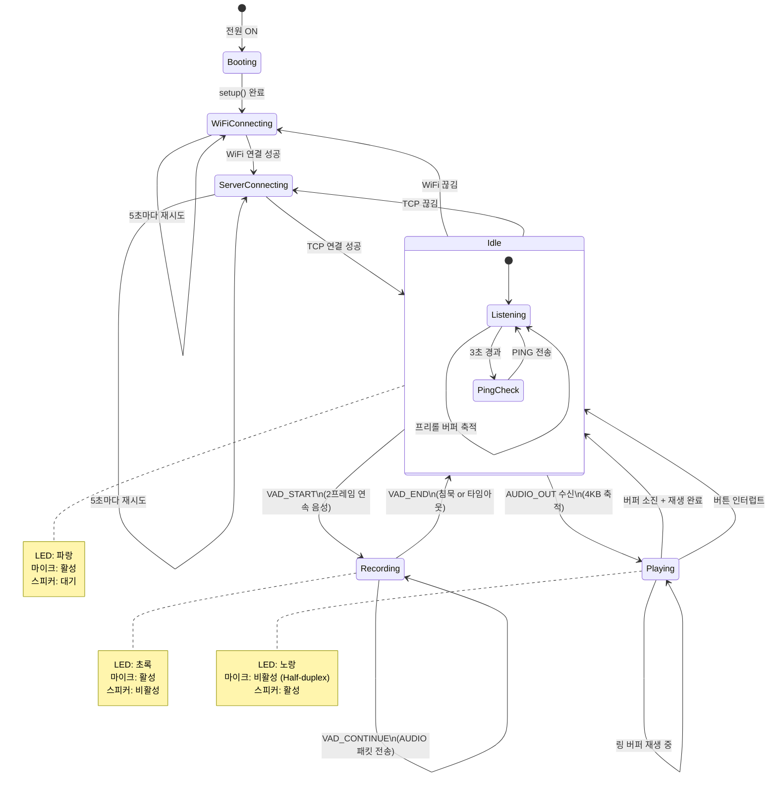
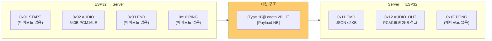
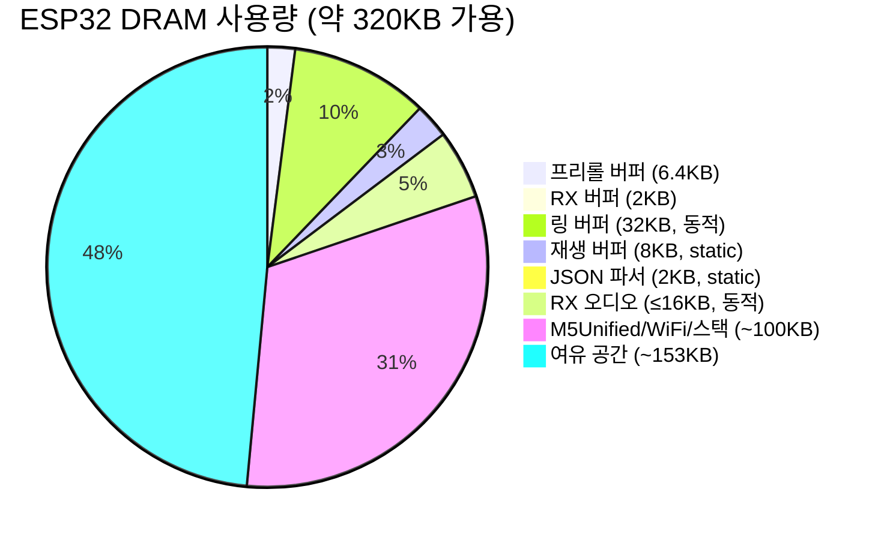

# LLM Arduino — 시스템 아키텍처

---

## 1. Application Level — 전체 시스템 구성

사용자 음성 → ESP32 → PC 서버 → AI 처리 → ESP32 응답의 전체 흐름.

---

## 2. Module Level — ESP32 소프트웨어 모듈 의존성

각 `.cpp/.h` 파일 간의 의존 관계와 데이터 흐름.

---

## 3. Data Flow Level — 음성 입출력 파이프라인

20ms 프레임 단위의 오디오 데이터 흐름.

---

## 4. Hardware Level — Atom Echo 핀 맵 및 버스 구조

ESP32-PICO-D4 내부 버스와 외부 핀 연결.

---

## 5. State Machine Level — 메인 루프 상태 전이

loop() 내부의 상태 전이 다이어그램.

---

## 6. Protocol Level — 패킷 구조 및 방향

---

## 7. Memory Layout — ESP32 DRAM 사용량

