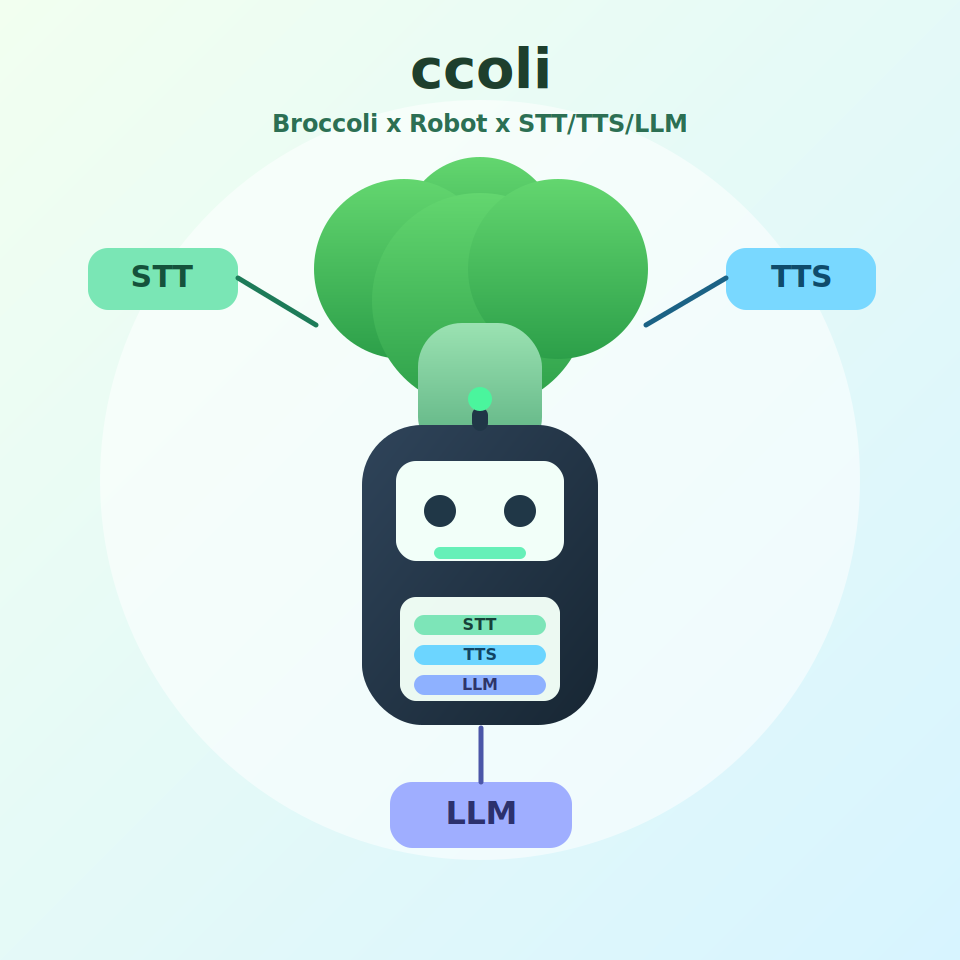

# ccoli


`ccoli` is a voice-first Arduino + Python assistant platform that combines:
- STT (Speech-to-Text)
- TTS (Text-to-Speech, sometimes written as TSS in older notes)
- LLM (local Ollama-based reasoning)



## Project Status

- Agent mode: Available now
- Robot mode: Unavailable (in development)

Robot mode is planned as a Servo + Display combined interaction mode, but it is not released yet.

## Quick Start

### 1) Install dependencies

```bash
pip install -r server/requirements.txt
pip install -e .
```

### 2) Configure WiFi + password + port

```bash
ccoli config wifi <WiFi Name> password <password> port <port>
```

Example:

```bash
ccoli config wifi MyHomeWiFi password MySecretPass port 5001
```

Compatibility alias is also supported:

```bash
colli config wifi MyHomeWiFi password MySecretPass port 5001
```

This command updates:
- `server/config.yaml` (`server.port`)
- `arduino/atom_echo_m5stack_esp32_ino/device_secrets.h` (SSID/PASS/SERVER_PORT)

Then set `SERVER_IP` in `arduino/atom_echo_m5stack_esp32_ino/device_secrets.h` to your server machine IP.

### 3) Start server

```bash
ccoli start
```

### 4) Flash Arduino firmware

Use:
- `arduino/atom_echo_m5stack_esp32_ino/atom_echo_m5stack_esp32_ino.ino`

Make sure `arduino/atom_echo_m5stack_esp32_ino/device_secrets.h` exists before build/upload.

## CLI Commands

- `ccoli start`
  - Starts `server/server.py`
- `ccoli start --port 5002`
  - Temporary port override for one run
- `ccoli config wifi <WiFi Name> password <password> port <port>`
  - Applies WiFi/password/port settings to server + firmware secrets

## Repository Layout

```text
.
+-- arduino/
|   +-- atom_echo_m5stack_esp32_ino/
|       +-- atom_echo_m5stack_esp32_ino.ino
|       +-- config.h
|       +-- config.h.example
|       +-- device_secrets.h.example
+-- ccoli/
|   +-- cli.py
+-- docs/
|   +-- API.md
|   +-- PROTOCOL.md
|   +-- assets/
|       +-- ccoli-logo.svg
|       +-- ccoli-character.svg
+-- server/
|   +-- server.py
|   +-- config.yaml
|   +-- src/
+-- QUICKSTART.md
```

## Configuration

- Server defaults: `server/config.yaml`
- Environment overrides: `server/.env` (see `server/env.example`)
- Robot mode gate:
  - `server/config.yaml` -> `features.robot_mode_enabled`
  - default is `false`

## Security Notes

- Never commit real credentials in firmware files.
- Local secrets belong in:
  - `arduino/atom_echo_m5stack_esp32_ino/device_secrets.h`
- This file is git-ignored by default.

## Documentation

- Quick onboarding: `QUICKSTART.md`
- Server module map: `docs/API.md`
- Binary protocol details: `docs/PROTOCOL.md`

## License

MIT. See `LICENSE`.
