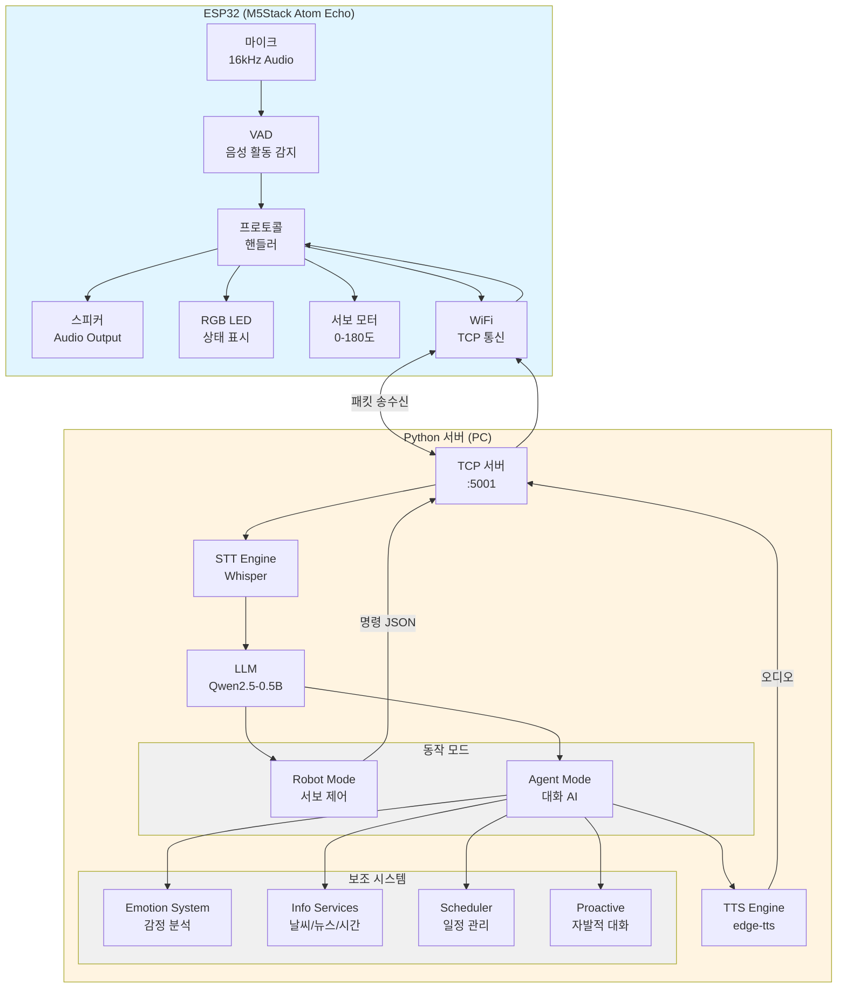
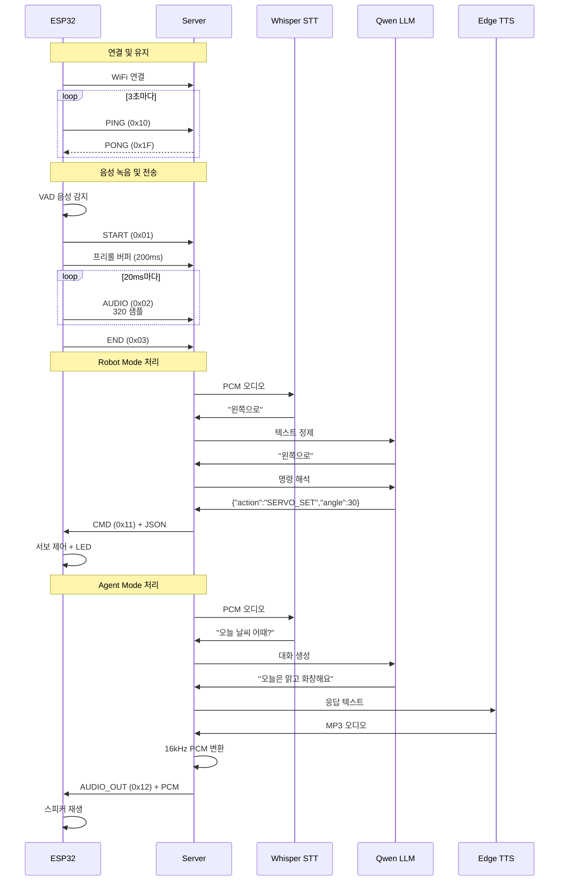
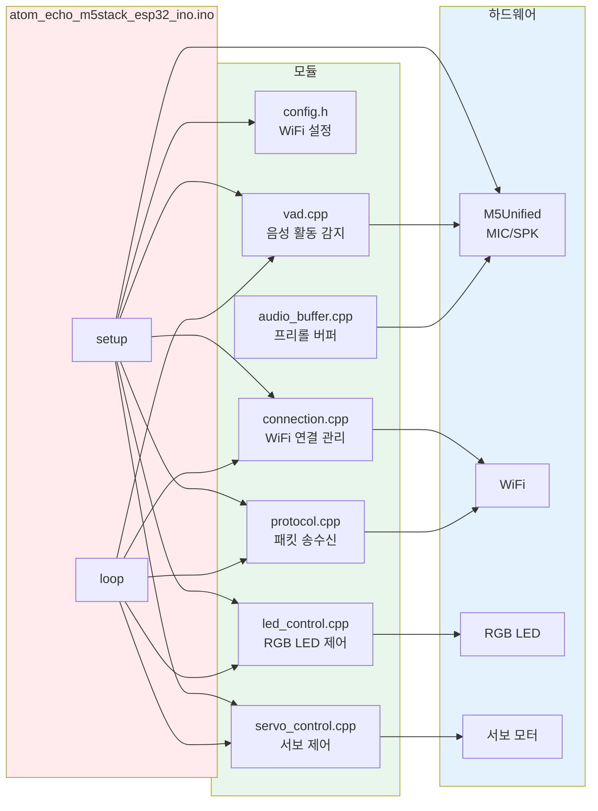
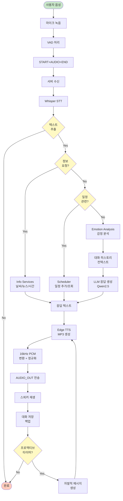
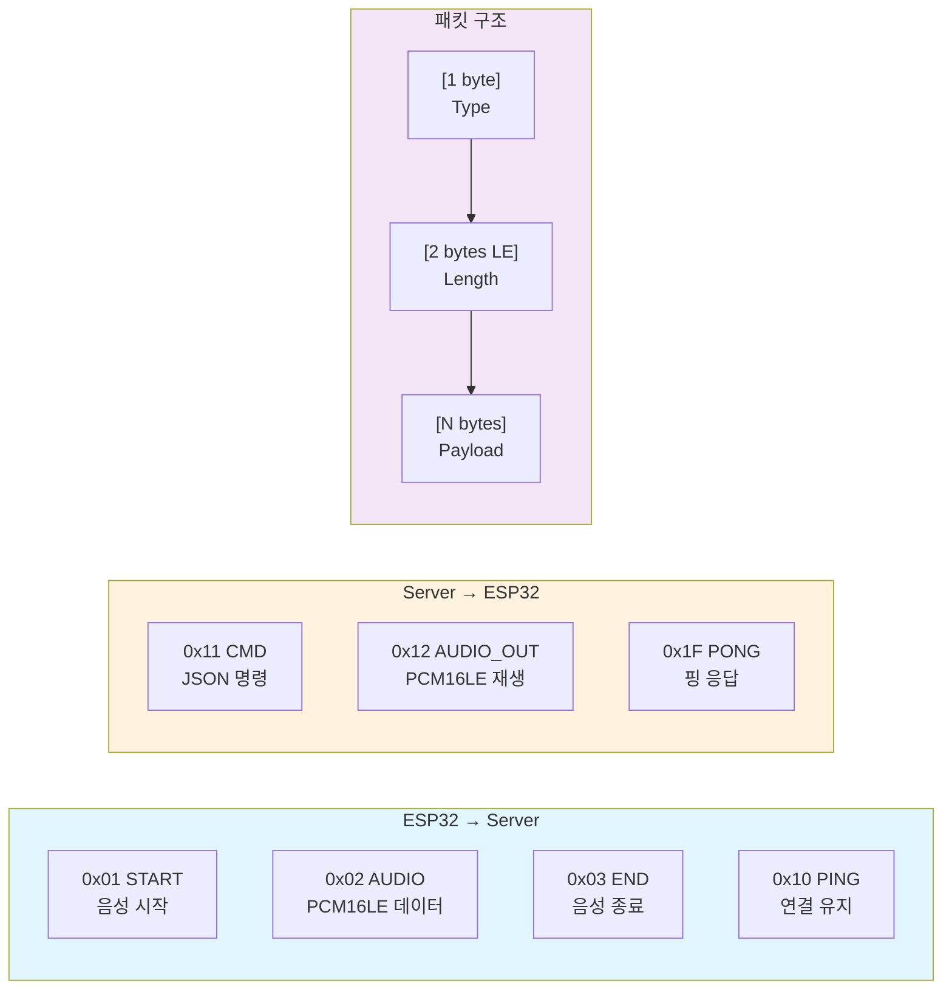
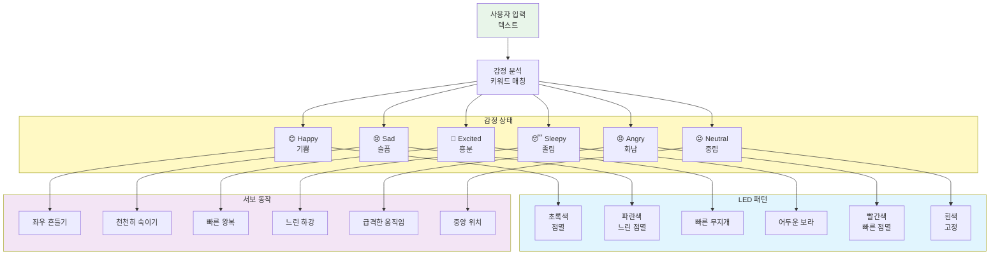
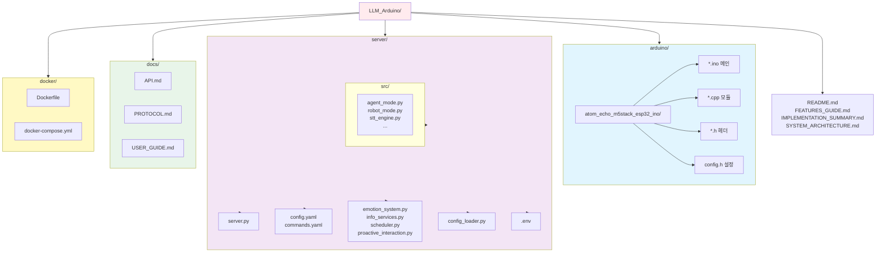
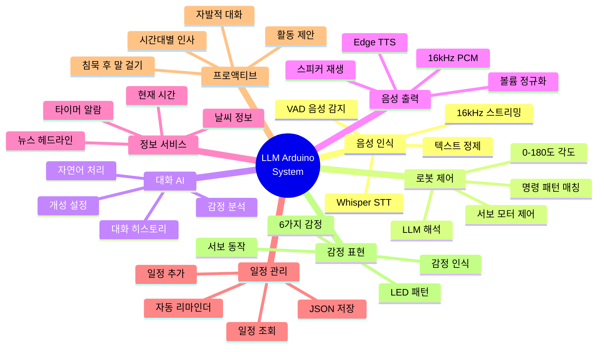

# LLM Arduino 시스템 구성도

## 1. 전체 시스템 개요



## 2. 통신 프로토콜 상세



## 3. ESP32 소프트웨어 구조



## 4. 서버 소프트웨어 구조

```mermaid
graph TB
    subgraph MAIN_S["server.py (메인)"]
        MAIN_LOOP[메인 루프<br/>연결 수락]
        CONN_HANDLER[handle_connection<br/>클라이언트 처리]
        WORKER[Worker Thread<br/>STT/LLM 처리]
    end
    
    subgraph CORE["핵심 모듈 (src/)"]
        STT_E[stt_engine.py<br/>Whisper STT]
        ROBOT_M[robot_mode.py<br/>명령 파싱/제어]
        AGENT_M[agent_mode.py<br/>대화 AI]
        AUDIO_P[audio_processor.py<br/>오디오 정규화]
        PROTO_S[protocol.py<br/>패킷 송수신]
        CONN_M[connection_manager.py<br/>TCP 연결]
        QUEUE[job_queue.py<br/>작업 큐]
    end
    
    subgraph FEATURES["기능 시스템"]
        EMOTION_S[emotion_system.py<br/>감정 분석]
        INFO_S[info_services.py<br/>날씨/뉴스/시간]
        SCHED_S[scheduler.py<br/>일정/리마인더]
        PROACT_S[proactive_interaction.py<br/>자발적 상호작용]
    end
    
    subgraph CONFIG_S["설정"]
        CFG_YAML[config.yaml<br/>전역 설정]
        CMD_YAML[commands.yaml<br/>로봇 명령]
        CFG_LOADER[config_loader.py<br/>설정 로더]
        ENV[.env<br/>API 키]
    end
    
    subgraph UTILS["유틸리티"]
        LOG[logging_setup.py<br/>로깅]
        UTILS[utils.py<br/>헬퍼 함수]
    end
    
    MAIN_LOOP --> CONN_HANDLER
    CONN_HANDLER --> WORKER
    CONN_HANDLER --> CONN_M
    CONN_HANDLER --> PROTO_S
    CONN_HANDLER --> QUEUE
    
    WORKER --> STT_E
    WORKER --> ROBOT_M
    WORKER --> AGENT_M
    WORKER --> AUDIO_P
    
    ROBOT_M --> CMD_YAML
    AGENT_M --> EMOTION_S
    AGENT_M --> INFO_S
    AGENT_M --> SCHED_S
    AGENT_M --> PROACT_S
    
    CONN_HANDLER --> CFG_LOADER
    CFG_LOADER --> CFG_YAML
    CFG_LOADER --> ENV
    
    MAIN_LOOP --> LOG
    WORKER --> LOG
    AGENT_M --> UTILS
    ROBOT_M --> UTILS
    
    style MAIN_S fill:#ffebee
    style CORE fill:#e1f5fe
    style FEATURES fill:#f3e5f5
    style CONFIG_S fill:#fff9c4
    style UTILS fill:#e0f2f1
```

## 5. 데이터 흐름 (Robot Mode)

```mermaid
flowchart TD
    START([사용자 음성])
    
    MIC[마이크 녹음<br/>16kHz, 20ms]
    VAD_CHECK{VAD<br/>음성 감지?}
    BUFFER[프리롤 버퍼<br/>200ms 유지]
    SEND_START[START 전송]
    SEND_AUDIO[AUDIO 전송<br/>20ms마다]
    SILENCE{침묵<br/>감지?}
    SEND_END[END 전송]
    
    RECV[서버 수신]
    QC[품질 체크<br/>RMS/Peak]
    QC_OK{품질<br/>OK?}
    TRIM[무음 제거<br/>정규화]
    STT_PROC[Whisper STT]
    TEXT{텍스트<br/>있음?}
    
    LLM_REFINE[LLM 정제<br/>오타 수정]
    PARSE[commands.yaml<br/>패턴 매칭]
    MATCH{명령<br/>매칭?}
    LLM_INTERP[LLM 해석<br/>JSON 생성]
    
    ACTION[{"action":"SERVO_SET"<br/>"angle":90}]
    SEND_CMD[CMD 전송]
    
    ESP_RECV[ESP32 수신]
    SERVO_CTRL[서보 제어]
    LED_CTRL[LED 표시]
    
    FINISH([완료])
    
    START --> MIC
    MIC --> VAD_CHECK
    VAD_CHECK -->|No| BUFFER
    BUFFER --> MIC
    VAD_CHECK -->|Yes| SEND_START
    SEND_START --> SEND_AUDIO
    SEND_AUDIO --> SILENCE
    SILENCE -->|No| SEND_AUDIO
    SILENCE -->|Yes| SEND_END
    
    SEND_END --> RECV
    RECV --> QC
    QC --> QC_OK
    QC_OK -->|No| FINISH
    QC_OK -->|Yes| TRIM
    TRIM --> STT_PROC
    STT_PROC --> TEXT
    TEXT -->|No| FINISH
    TEXT -->|Yes| LLM_REFINE
    
    LLM_REFINE --> PARSE
    PARSE --> MATCH
    MATCH -->|Yes| ACTION
    MATCH -->|No| LLM_INTERP
    LLM_INTERP --> ACTION
    
    ACTION --> SEND_CMD
    SEND_CMD --> ESP_RECV
    ESP_RECV --> SERVO_CTRL
    ESP_RECV --> LED_CTRL
    SERVO_CTRL --> FINISH
    LED_CTRL --> FINISH
    
    style START fill:#c8e6c9
    style FINISH fill:#ffccbc
    style VAD_CHECK fill:#fff9c4
    style QC_OK fill:#fff9c4
    style TEXT fill:#fff9c4
    style MATCH fill:#fff9c4
    style SILENCE fill:#fff9c4
```

## 6. 데이터 흐름 (Agent Mode)



## 7. 패킷 프로토콜 명세



## 8. 감정 시스템 구조



## 9. 디렉토리 구조



## 10. 주요 기능 흐름



## 설정 파일 요약

### config.yaml (서버)
- 서버 설정 (host, port)
- STT 설정 (model, device)
- 어시스턴트 설정 (이름, 성격, TTS 음성)
- 로깅 설정
- 큐 설정

### commands.yaml (로봇 모드)
- 명령 패턴 정의
- 키워드 매칭
- 정규식 패턴
- 서보 각도 설정

### config.h (ESP32)
- WiFi SSID/비밀번호
- 서버 IP/포트
- LED 색상
- 오디오 설정

## 시스템 요구사항

### 하드웨어
- **ESP32**: M5Stack Atom Echo
- **PC/서버**: GPU 권장 (CUDA 지원)
- **네트워크**: 동일 LAN 환경

### 소프트웨어
- **Arduino**: M5Unified 라이브러리
- **Python**: 3.9+
- **주요 라이브러리**:
  - faster-whisper (STT)
  - transformers (LLM)
  - edge-tts (TTS)
  - numpy, librosa (오디오 처리)

## 성능 특성

- **STT 레이턴시**: ~0.5-1초 (GPU)
- **LLM 레이턴시**: ~0.2-2초
- **TTS 레이턴시**: ~1-2초
- **총 응답 시간**: ~2-4초
- **오디오 품질**: 16kHz, 16-bit PCM
- **네트워크 대역폭**: ~32KB/s (녹음 시)

---

**생성 날짜**: 2026-02-03
